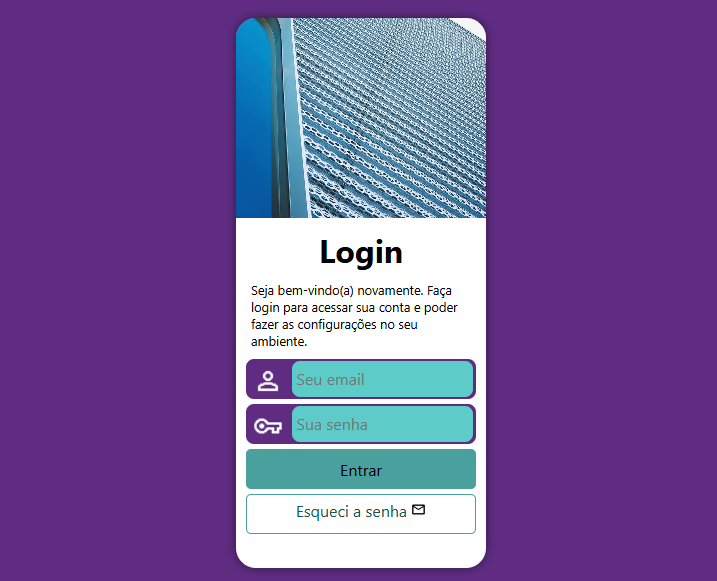
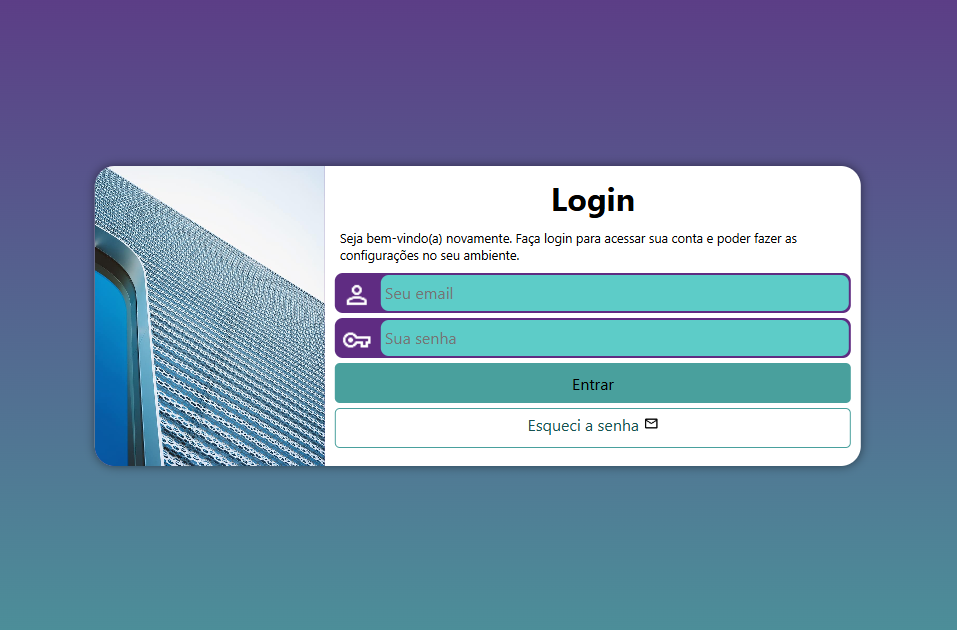
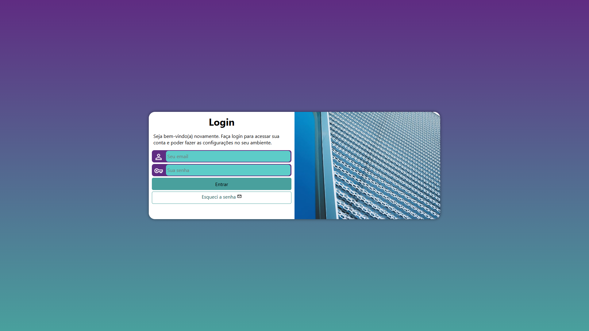

# 🔐 Tela de Login Responsiva

Este projeto é uma interface de autenticação moderna e responsiva, projetada para proporcionar uma experiência de login elegante e funcional em qualquer dispositivo. A tela combina uma estética visual agradável com um formulário de acesso intuitivo.

Desenvolvido como parte dos estudos de **HTML5 e CSS3**, este projeto teve como foco principal a aplicação prática de **Media Queries** e técnicas de **posicionamento avançado**, consolidando os conceitos de responsividade e design adaptativo.

---

## 🚀 Tecnologias e Conceitos Aplicados

O desenvolvimento foi realizado utilizando apenas **HTML5 e CSS3 puros**, sem dependência de frameworks externos. Os principais pilares técnicos explorados foram:

* **Design Responsivo (Mobile First):** A estrutura base foi pensada para telas pequenas (`width: 250px`), expandindo-se e reorganizando-se através de breakpoints estratégicos em `768px` e `992px` utilizando `@media screen`.
* **Flexibilidade de Layout com Floats:** Uso controlado da propriedade `float` nas media queries para alternar a posição da imagem e do formulário lado a lado em tablets e desktops, garantindo um layout de duas colunas em resoluções maiores.
* **Transições Suaves:** Aplicação de `transition` nas dimensões (`width` e `height`) da seção de login, proporcionando uma mudança de layout fluida e não abrupta ao redimensionar a janela.
* **Background com Gradiente:** Utilização de `linear-gradient` para criar um fundo dinâmico que mescla tons de verde (`#49a09d`) e lilás (`#5f2c82`), mantendo a identidade visual em todas as resoluções.
* **Posicionamento Absoluto e Centralização:** Emprego da técnica clássica com `position: absolute`, `top: 50%`, `left: 50%` e `transform: translate(-50%, -50%)` para manter o card de login perfeitamente centralizado na viewport.
* **Estilização de Formulários:** Customização completa dos campos de input, com efeitos de foco (`:focus-within`), ícones integrados e botões com estados de hover.

---

## 📂 Estrutura de Arquivos

O projeto foi organizado de forma modular para separar as responsabilidades de estilização:

* `index.html`: Contém a estrutura semântica do formulário de login, incluindo campos de e-mail e senha.
* `estilos/style.css`: Arquivo de estilo principal. Define o layout base (mobile-first), as cores, tipografia, estilos dos inputs e o posicionamento absoluto.
* `estilos/media-queries.css`: Arquivo dedicado exclusivamente às adaptações de layout para telas maiores (Tablet e Desktop), aplicando as regras de `float` e ajustes de largura.

---

## 🎨 Paleta de Cores

| Cor         | Código Hex | Uso                         |
|-------------|------------|-----------------------------|
| Verde       | `#49a09d`  | Gradiente, botão, bordas     |
| Lilás       | `#5f2c82`  | Gradiente, fundo dos campos  |
| Verde Claro | `#5dccc8`  | Fundo dos inputs, hover      |
| Verde Escuro| `#175351`  | Hover do botão, links        |

---

## 📱 Breakpoints de Responsividade

| Dispositivo | Largura da Tela | Layout                                    |
|-------------|-----------------|-------------------------------------------|
| Mobile      | `< 768px`       | Card vertical (250x550px)                 |
| Tablet      | `768px - 992px` | Card horizontal (80vw x 300px), imagem 30% |
| Desktop     | `≥ 992px`       | Card largo (950x350px), imagem e form 50%  |

---

## 📖 Como visualizar o projeto?

Você pode testar a responsividade redimensionando a janela do seu navegador ou utilizando as ferramentas de desenvolvedor (DevTools) para simular diferentes dispositivos.

👉 [Clique aqui para acessar o Projeto Tela de Login](https://valdirneto34.github.io/Projeto-Login/)

---

## 🛠️ Como rodar localmente?

1. Clone este repositório em sua máquina:
   ```bash
   git clone https://valdirneto34.github.io/Projeto-Login/
   ```

---

## 📝 Licença

Este projeto foi desenvolvido para fins educacionais. Sinta-se à vontade para utilizar e modificar o código conforme necessário.

---

## 📖 Screenshots do Projeto

   <p align="center">
        <strong>📱 Versão Mobile</strong><br>
        
    </p>
    <p align="center"> <strong>📟 Versão Tablet</strong><br> 
     
    </p>
   <p align="center">
        <strong>💻 Versão Desktop</strong><br>
        
    </p>
